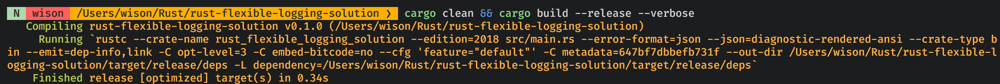
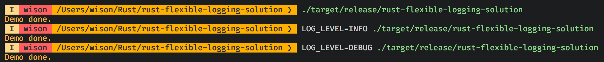
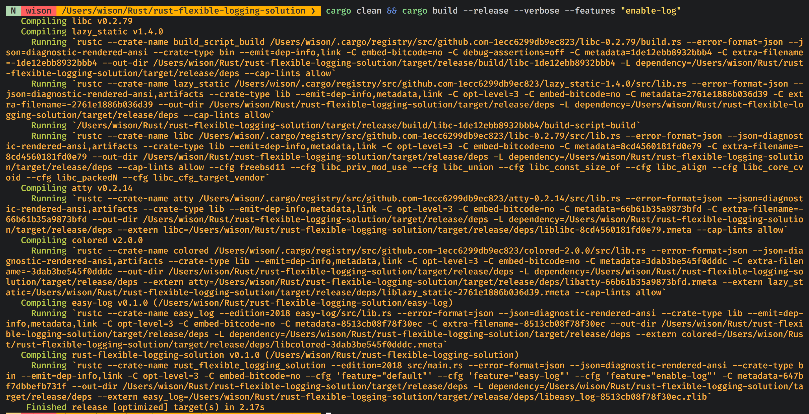
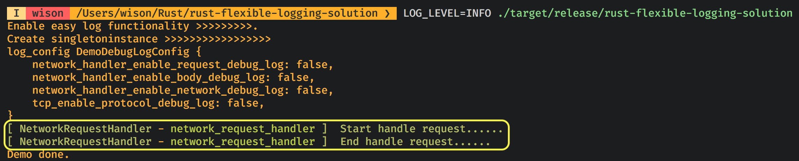
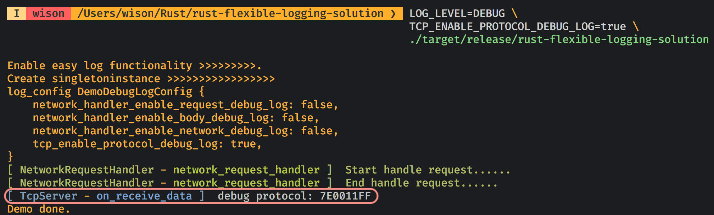
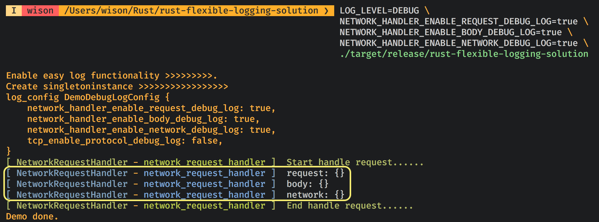

# The flexible logging solution in `Rust`

This demo shows a flexible logging solution for any `Rust` program.

First thing first, let’s list all questions and requirements for logging:

1. We need to control whether to enable the logging functionality or not. 
When disabled, the production binary should not contain any logging functionality code, 
as that's rubbish code and never get called. Obviously, that's a _**conditional compilation**_ requirement.

2. When enabled, we need a `LOG_LEVEL` flag to control logging category which same with the normal logging library does:
    - `Debug`
    - `Info`
    - `Warning`
    - `Error`

</br>

3. Usually, we set `LOG_LEVEL=Debug` for the daily coding process, as we need to log everything we need to know when we're
working on a particular feature or functionality. And usually, that's a lot of debug info print to console (stdout). 
It's pretty hard to focus the current working feature debug info. If there is a setting which allows only to print the 
current working feature debug log to the console, that will be great. That's why we need:

    - One more level under `LOG_LEVEL=DEBUG` to be able to filter the debug info.
    - We should be able to define one or more extra flag for each project, not just built-in the logging library for getting the best flexible.


</br>

Ok, that's a very clear requirement, but how do we make that happen? Let's do it :)


## Step-by-step solution

### 1. Use `features` for the conditional compilation

[`Cargo features`](https://doc.rust-lang.org/cargo/reference/features.html) provides a very flexible conditional compilation solution.
Let's have a look at the below settings in `Cargo.toml`:

```rust
[features]

# By default, no feature enables
default = []

# Define a feature for logging functionality. If this feature is enabled,
# then the "easy-log" crate will be included in the compilation.
enable-log = ["easy-log"]

[dependencies]
# This crate is marked as "optional" which means NOT includes by default.
easy-log = { path = "./easy-log", version = "0.1.0", optional = true }
```

Then, we can use the `#[cfg(feature = "enable-log")]` attribute for the conditional compilation. For example:

```rust
#[cfg(feature = "enable-log")]
use easy_log::{EasyLog, EasyLogConfig};

#[cfg(feature = "enable-log")]
mod demo_log_config;

#[cfg(feature = "enable-log")]
use demo_log_config::DemoDebugLogConfig;

#[cfg(feature = "enable-log")]
{
    // Code block here......
}
```

So, we solved the requirement No.1.


### 2.  Use environment variables to solve the requirement **No.3**

After we implemented `EasyLog` utility, we can use the functions below to log different level info:

- `EasyLog::debug_log()`
- `EasyLog::info_log()`
- `EasyLog::warning_log()`
- `EasyLog::error_log()`

</br>

The next step, based on the `extra flag` we needed, we can define a customized log configuration like below:

```rust
#[cfg(feature = "enable-log")]
use std::env;

#[cfg(feature = "enable-log")]
use easy_log::EasyLogConfig;

#[cfg(feature = "enable-log")]
#[derive(Debug)]
pub struct DemoDebugLogConfig {
    pub network_handler_enable_request_debug_log: bool,
    pub network_handler_enable_body_debug_log: bool,
    pub network_handler_enable_network_debug_log: bool,
    pub tcp_enable_protocol_debug_log: bool
}
```

The attribute names in `DemoDebugLogConfig` struct are totally depended on what we need.

After that, we can create `DemoDebugLogConfig` instance and fill the attribute values based on the environment variables we pass in.
That means we can pass in and combination of the environment vars below based on the sample code above:

`NETWORK_HANDLER_ENABLE_REQUEST_DEBUG_LOG`
`NETWORK_HANDLER_ENABLE_BODY_DEBUG_LOG`
`NETWORK_HANDLER_ENABLE_NETWORK_DEBUG_LOG`
`TCP_ENABLE_PROTOCOL_DEBUG_LOG`

</br>

### The final result

- Let's build the production without any feature:

    

    When we run the binary, there is no log will print out, as there is no any logging code exists in the binary at all.

    

- So, let's build the production again with the `enable-log` feature:

    

    As you can see, all logging crates already included in the compilation process.

    When we run the binary, we got different debug info for different purpose based on what environment vars we pass in:

    - `LOG_LEVEL=INFO`:

        

    - `LOG_LEVEL=DEBUG TCP_ENABLE_PROTOCOL_DEBUG_LOG=true`: 

        

    - `LOG_LEVEL=DEBUG NETWORK_HANDLER_ENABLE_REQUEST_DEBUG_LOG=true NETWORK_HANDLER_ENABLE_BODY_DEBUG_LOG=true NETWORK_HANDLER_ENABLE_NETWORK_DEBUG_LOG=true`: 

        

